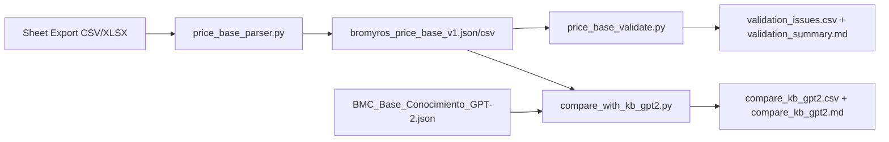

# Bromyros Price Base System

Canonical internal price base parser, validator, and KB comparison tool for Bromyros pricing data.

## Overview

This system:
1. **Parses** CSV/XLSX exports with the Bromyros column layout
2. **Normalizes** units (m², metro lineal, unidad) and extracts metadata (thickness, length)
3. **Validates** data quality and IVA consistency
4. **Compares** consumer prices against the master KB (`BMC_Base_Conocimiento_GPT-2.json`)

## Quick Start

### 1. Export Sheet Data

Export your Bromyros pricing sheet to CSV or XLSX with these columns:

| Excel Col | Index | Content |
|-----------|-------|---------|
| D | 3 | SKU |
| E | 4 | Product name + notes |
| F | 5 | Cost sin IVA |
| L | 11 | Sale price sin IVA |
| M | 12 | Sale price IVA inc. |
| T | 19 | Web sale price sin IVA (optional) |
| U | 20 | Web sale price IVA inc. (optional) |

### 2. Run the Pipeline

```bash
# From project root
python pricing/price_base.py path/to/export.csv
```

Or use the individual modules:

```python
from pricing.price_base_parser import parse_price_base, save_price_base
from pricing.price_base_validate import run_validation
from pricing.compare_with_kb_gpt2 import run_comparison

# Parse
price_base = parse_price_base("export.csv", iva_rate=0.22)
save_price_base(price_base, output_dir="pricing/out")

# Validate
validation = run_validation(price_base, output_dir="pricing/out")

# Compare with KB
comparison = run_comparison(
    price_base, 
    kb_path="BMC_Base_Conocimiento_GPT-2.json",
    output_dir="pricing/out"
)
```

### 3. Review Outputs

All outputs are saved to `pricing/out/`:

**Canonical Price Base:**
- `bromyros_price_base_v1.json` - Full structured data
- `bromyros_price_base_v1.csv` - Flattened for analysis

**Validation Reports:**
- `validation_issues.csv` - All data quality issues
- `validation_summary.md` - Human-readable summary

**KB Comparison Reports:**
- `compare_kb_gpt2.csv` - Detailed price comparisons
- `compare_kb_gpt2.md` - Summary with matches/mismatches

## Features

### Parsing & Normalization

**Product Detection:**
- Only processes rows with both SKU (col D) and name (col E)
- Skips section headers and notes

**Number Parsing:**
- Handles comma decimals: `1,50` → `1.50`
- Removes whitespace: ` 46.07 ` → `46.07`

**Type & Unit Base:**
- **Panels** (ISD, IW, IROOF, etc.) → `m2`
- **Profiles/gutters/cumbreras/babetas** → `metro_lineal` (piece + per_ml if length extracted)
- **Hardware/consumables** → `unidad`

**Metadata Extraction:**

*Thickness (from SKU or name):*
```
ISD100EPS → 100mm
IW80PIR → 80mm
"Isodec 150mm EPS" → 150mm
```

*Length (from name, for profiles):*
```
"Canalón / 3 m" → 3.0m
"Perfil (3,03m)" → 3.03m
"Babeta de 6,8 m" → 6.8m
"2 piezas de 1,1m" → 2.2m (total)
```

**Derived Fields:**
- **Business margin**: `(sale_sin_iva - cost_sin_iva) / sale_sin_iva`
- **Per metro lineal prices**: For profiles with extracted length
- **IVA consistency checks**: `sale_iva_inc ≈ sale_sin_iva × 1.22` (±1% tolerance)

### Validation

**Data Quality Checks:**
- Missing costs (col F)
- Missing sale prices (cols L/M)
- Negative prices
- Duplicate SKUs

**IVA Consistency:**
- Validates `col M ≈ col L × (1 + IVA)` and `col U ≈ col T × (1 + IVA)`
- Reports pass rate % and delta for inconsistencies

**Length Extraction Hit Rate:**
- Tracks % of profiles with successfully extracted length
- Helps tune regex patterns for better coverage

### KB Comparison

**Mapping Strategy:**

SKU patterns → KB product keys with keyword disambiguation:

| SKU Pattern | Default KB Key | Disambiguation |
|-------------|----------------|----------------|
| `ISD{n}EPS` | `ISODEC_EPS` | If name has "pared"/"fachada" → `ISOPANEL_EPS` |
| `ISD{n}PIR` | `ISODEC_PIR` | - |
| `IW{n}` | `ISOWALL_PIR` | - |
| `IROOF{n}`, `IAGRO{n}` | `ISOROOF_3G` | - |
| `IF{n}` | `ISOFRIG_PIR` | - |

**Price Comparison:**
- Compares **sheet consumer price (col M)** vs **KB `products[KEY].espesores[THICKNESS].precio`**
- Matches thickness extracted from SKU/name to KB espesor keys
- Reports:
  - **Match**: Within ±1% tolerance (configurable)
  - **Mismatch**: Delta % + severity (high >5%, medium ≤5%)
  - **Missing in KB**: SKU/thickness present in sheet but not in KB
  - **Missing in sheet** (reverse check): KB items absent from export

**Example Match:**
```
SKU: ISD100EPS
Name: "Isodec 100mm EPS Techo"
Thickness: 100mm
Sheet price (M): $46.07
KB: ISODEC_EPS @ 100mm → $46.07
✅ Match (0.0% delta)
```

**Example Mismatch:**
```
SKU: ISD150EPS
Name: "Isodec 150mm EPS"
Thickness: 150mm
Sheet price (M): $55.00
KB: ISODEC_EPS @ 150mm → $51.50
⚠️ Mismatch (+$3.50, 6.8% delta, severity: high)
```

## Module Reference

### `price_base_parser.py`

**Functions:**
- `parse_price_base(input_path, iva_rate=0.22)` - Main entry point
- `save_price_base(price_base, output_dir, save_csv=True, save_json=True)` - Save outputs
- `extract_thickness_mm(sku, name)` - Extract thickness
- `extract_length_m(name)` - Extract piece length
- `categorize_product(sku, name)` - Determine tipo/familia/unit_base

### `price_base_validate.py`

**Functions:**
- `run_validation(price_base, output_dir)` - Main entry point
- `validate_price_base(price_base)` - Run all checks
- `save_validation_reports(validation, output_dir)` - Save CSV + MD

### `compare_with_kb_gpt2.py`

**Functions:**
- `run_comparison(price_base, kb_path, output_dir, tolerance_pct=1.0, include_reverse_check=True)` - Main entry point
- `compare_with_kb(price_base, kb_path, tolerance_pct)` - Compare prices
- `map_sku_to_kb_key(sku, name)` - Map SKU to KB product key
- `check_missing_in_sheet(kb, price_base)` - Reverse check

## Configuration

**IVA Rate:**
```python
# Default from KB: 0.22
price_base = parse_price_base("export.csv", iva_rate=0.22)
```

**Comparison Tolerance:**
```python
# Default ±1%, can increase for looser matching
comparison = run_comparison(price_base, kb_path, tolerance_pct=2.0)
```

**Reverse Check:**
```python
# Disable reverse check (KB → sheet)
comparison = run_comparison(price_base, kb_path, include_reverse_check=False)
```

## Troubleshooting

### Low Length Extraction Hit Rate

If `validation_summary.md` shows low hit rate for profile length extraction:

1. Check `validation_issues.csv` for `missing_length` rows
2. Review name patterns in col E
3. Add new regex patterns to `extract_length_m()` in `price_base_parser.py`

### High IVA Inconsistencies

If many IVA check failures:

1. Verify IVA rate (should be 0.22 for Uruguay)
2. Check `validation_issues.csv` for specific SKUs with inconsistencies
3. Look for data entry errors in source sheet (cols L/M or T/U)

### Many "Missing in KB" Items

If comparison shows many items present in sheet but not KB:

1. Check `compare_kb_gpt2.csv` for patterns
2. Verify SKU mapping rules in `SKU_TO_KB_MAPPING` dict
3. Check if KB needs updating with new products/thicknesses
4. Review thickness extraction (might be extracting wrong value from name)

### No Matches Found

If comparison finds zero matches:

1. Verify column indices match your export (D=SKU, E=name, etc.)
2. Check that export includes col M (sale_iva_inc) with consumer prices
3. Review SKU formats in export vs expected patterns
4. Check KB file path is correct and file is readable

## Dependencies

```bash
pip install openpyxl  # For .xlsx support
```

Standard library only for CSV parsing.

## Related Files

- **Master KB**: `BMC_Base_Conocimiento_GPT-2.json` - Source of truth for product prices
- **Legacy parser**: `parse_costos_ventas.py` - Old matrix parser (different column layout)

## Workflow Diagram



## Support

For questions or issues:
1. Check `validation_summary.md` and `compare_kb_gpt2.md` for diagnostics
2. Review CSV outputs for detailed row-level data
3. Verify export column layout matches documented format
4. Check regex patterns in parser if metadata extraction fails
